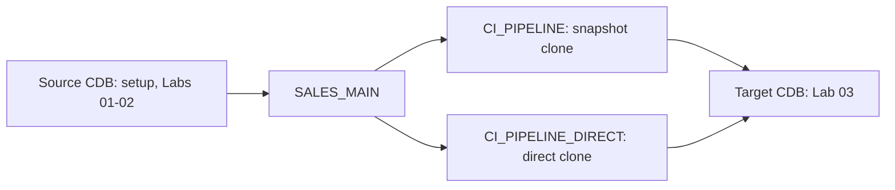

# Prepare Your Environment

Use a nonproduction environment. The labs create and drop PDBs, snapshots, services, and Clusterware resources.

## Topology

Labs 01 and 02 use one Oracle RAC source CDB. Setup creates `SALES_MAIN` there.
Lab 03 needs a separate, differently named Oracle RAC target CDB for `CI_PIPELINE` and `CI_PIPELINE_DIRECT`.



Lab 03 snapshot-copy thin cloning requires both CDBs to use the same Exascale vault. The CDBs can be in separate VM clusters, provided the target database servers can reach the source CDB SCAN service. Cloning between Exascale vaults is not supported. See [Thin Cloning a Pluggable Database in a Different Container Database](https://docs.oracle.com/en/engineered-systems/exadata-database-machine/exscl/cloning-pdb-into-different-cdb.html).

## Platform and Access

| Component | Requirement |
|---|---|
| Database | Oracle AI Database 26ai |
| Platform | Exadata Exascale with Exadata System Software 24.1 or later |
| Architecture | Oracle Multitenant and Oracle RAC with two or more instances |
| Storage | Oracle Managed Files enabled |
| Client | SQLcl is recommended; SQL*Plus is supported |
| CDB cloning | gDBClone 5.0.2.2 or later |
| Administration | SYSDBA privileges and access to `srvctl` for each lab CDB |

The shell runners use `common/manage-pdb-clusterware.sh`. Run them as an account that can run `srvctl` for the source CDB and, for Lab 03, the target CDB.

Labs 01-03 use SQL PDB snapshot and cloning statements and do not invoke gDBClone.
gDBClone 5.0.2.2 is the tested minimum for the forthcoming CDB thin-clone labs.

## Verify Each CDB

Connect to `CDB$ROOT` as SYSDBA in the source CDB. Repeat the relevant checks in the target CDB for Lab 03.

```sql
SELECT name, cdb FROM v$database;

SELECT sys_context('USERENV', 'CON_NAME') AS container_name FROM dual;

SELECT inst_id, instance_name FROM gv$instance ORDER BY inst_id;

SELECT name, value
FROM   v$parameter
WHERE  name IN ('db_unique_name', 'db_create_file_dest')
ORDER  BY name;
```

Confirm the CDB is open, the current container is `CDB$ROOT`, all RAC instances are available, and `DB_CREATE_FILE_DEST` has an OMF destination.

Set these values for the CDB whose PDB resources the scripts will manage:

```bash
export CDB_UNIQUE_NAME=<value-of-db_unique_name>
export RAC_SERVICE_PREFERRED=<instance-name-1>,<instance-name-2>
```

For example:

```bash
export CDB_UNIQUE_NAME=labcdb
export RAC_SERVICE_PREFERRED=labcdb1,labcdb2
```

## Database Parameters and Capacity

Set `GLOBAL_NAMES` to `FALSE` in both CDBs before beginning the lab series:

```sql
ALTER SYSTEM SET GLOBAL_NAMES = FALSE SCOPE = BOTH SID = '*';

SELECT inst_id, value
FROM   gv$parameter
WHERE  name = 'global_names'
ORDER  BY inst_id;
```

Lab 03 uses database links. Confirm both parameters are nonzero on every RAC instance in both CDBs:

```sql
SELECT inst_id, name, value
FROM   gv$system_parameter
WHERE  name IN ('open_links', 'open_links_per_instance')
ORDER  BY inst_id, name;
```

Check fast recovery area capacity before Lab 03:

```sql
SELECT name,
       space_limit / 1024 / 1024 / 1024 AS space_limit_gb,
       space_used / 1024 / 1024 / 1024 AS space_used_gb,
       space_reclaimable / 1024 / 1024 / 1024 AS reclaimable_gb
FROM   v$recovery_file_dest;
```

Maintain regular RMAN backups and an archived-log deletion policy when retaining CDBs after the lab. This preserves recovery-area capacity for normal work and remote cloning.

## Network and Host Checks

For Lab 03, every target-CDB database server must resolve and connect to the source CDB SCAN service. Use CDB root services, not PDB services, for Lab 03 administrative connections and the database link. Verify the reverse path for full lab-series readiness.

Verify the Exadata software level from a central database server:

```bash
cd setup
./03-verify-exadata-software.sh \
  --dbs-nodes dbnode01,dbnode02 \
  --cells-nodes cell01,cell02,cell03
```

This optional host check needs passwordless SSH as `oracle` to database servers and as `celladmin` to storage servers. The database-server account needs passwordless `sudo` access to `dbmcli`. Add `--cells-user root` when storage-server SSH uses `root`. SQL lab steps do not need this host access.

## Configure and Execute

Clone the repository on a database server where SQLcl or SQL*Plus and `srvctl` are available. Keep the default names in `common/config.sql` unless you need to adapt the workshop naming convention. Do not commit local configuration.

For Labs 01 and 02, optionally set an explicit source-CDB connection:

```bash
export LAB_DB_CONNECT='/ as sysdba'
```

For Lab 03, create the local ignored configuration file and set its source and target CDB names, source SCAN service, source-link credential, snapshot name, and target PDB names:

```bash
cd lab-03-cross-cdb-cloning
cp config.sql.example config.sql
```

Supply separate CDB root-service connections:

```bash
export LAB03_SOURCE_DB_CONNECT='sys/<source-password>@//<source-scan>:1521/<source-cdb-service> as sysdba'
export LAB03_TARGET_DB_CONNECT='sys/<target-password>@//<target-scan>:1521/<target-cdb-service> as sysdba'
```

Treat `config.sql` and these environment variables as credentials. Do not add them to shell profiles, command history, or source control.

Run `setup/00-setup.sh` in the source CDB, then execute the labs in numerical order. Reset scripts remove lab-created PDBs, snapshots, services, and Clusterware resources. Review their targets before running them.

## Readiness Checklist

- [ ] A nonproduction Oracle AI Database 26ai RAC CDB on Exadata Exascale is available, with Exadata System Software 24.1 or later.
- [ ] OMF, Exascale storage, and fast recovery area capacity are available.
- [ ] SYSDBA and `srvctl` access are available for the lab CDBs.
- [ ] `CDB_UNIQUE_NAME` and `RAC_SERVICE_PREFERRED` are set for managed PDBs.
- [ ] `GLOBAL_NAMES` is `FALSE` in both CDBs.
- [ ] `OPEN_LINKS` and `OPEN_LINKS_PER_INSTANCE` are nonzero for Lab 03.
- [ ] Lab 03 CDBs share one Exascale vault. They may be in separate VM clusters, and target database servers can reach the source CDB SCAN service.
