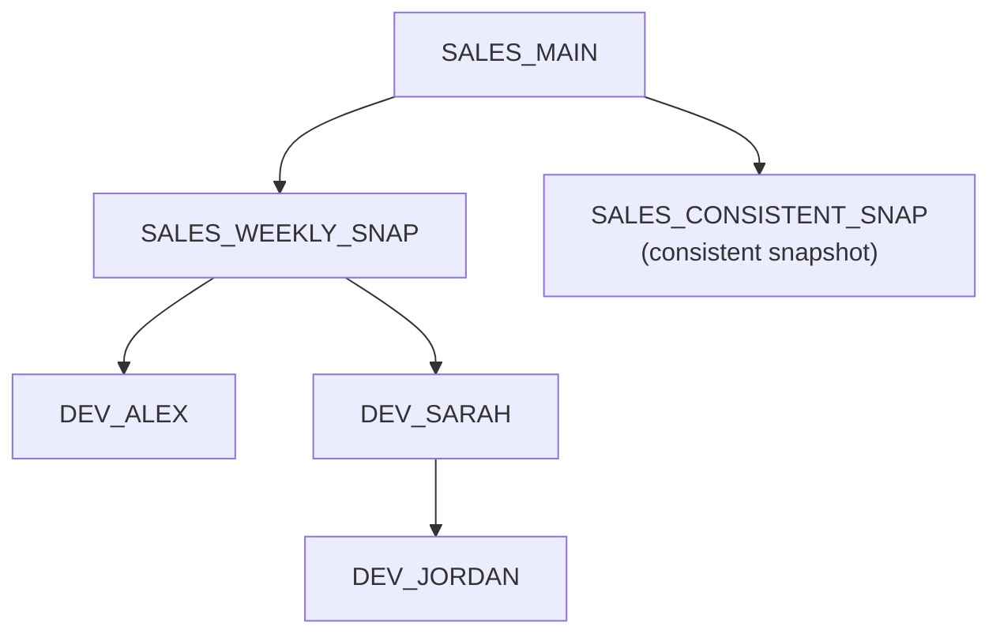

# Lab 01: PDB Thin Clones

This lab demonstrates how to provision thin development PDBs from a stable weekly source on Exadata Exascale.

The workflow follows the repository reference architecture:



`SALES_MAIN` is the masked development source created by the setup scripts. `SALES_WEEKLY_SNAP` is a named PDB snapshot used as the reusable clone source. `DEV_ALEX` and `DEV_SARAH` are independent read-write thin clones.
`SALES_CONSISTENT_SNAP` is a `CONSISTENT` snapshot. The later clone steps use `SALES_WEEKLY_SNAP`.
`DEV_JORDAN` is a thin clone created from `DEV_SARAH` to demonstrate a hierarchical clone workflow.

`common/verify-storage.sql` reports logical database allocation. Physical
sharing, clone dependency metadata, and changed-block growth require the
optional on-premises companion described in [Physical storage verification](#physical-storage-verification).

## Prerequisites

Complete [Prepare Your Environment](../docs/environment-setup.md) before
running setup or this lab.

- Oracle AI Database 26ai
- Exadata Exascale
- Exadata System Software 24.1 or later
- Oracle RAC with two or more instances
- Oracle Managed Files enabled
- SQLcl or SQL*Plus
- SYSDBA or equivalent privileges
- `SALES_MAIN` exists and is open
- A separate target CDB is available for Lab 03. Lab 01 operates only in the
  source CDB.
- For the optional Exadata software check: passwordless SSH equivalence from a
  central database server to the database servers as `oracle`, with
  passwordless `sudo` access to `dbmcli`, and to the storage servers as
  `celladmin` (the default) or `root`. This is required by
  `../setup/03-verify-exadata-software.sh`.

Run setup first if required:

```bash
../setup/03-verify-exadata-software.sh \
  --dbs-nodes dbnode01,dbnode02 \
  --cells-nodes cell01,cell02,cell03
```

To use `root` for the storage-server checks instead of the default `celladmin`, add `--cells-user root`.

```sql
@../setup/00-create-sales-main.sql
@../setup/01-mask-data.sql
@../setup/02-verify-environment.sql
```

## Consistent Snapshots

By default, a PDB snapshot captures the point in time quickly. Any required redo
application is deferred until a clone is created from that snapshot, so the redo
must remain available. A snapshot created with `CONSISTENT` applies that redo
during snapshot creation instead. This takes longer initially, but allows later
clones to be created without the same redo-application work and without retaining
the original redo, which makes it well suited to long-lived, ready-to-clone
baselines.

`SALES_CONSISTENT_SNAP` in this lab uses this option. The later clone steps
continue to use `SALES_WEEKLY_SNAP`.

For a detailed explanation, see [Exascale Snapshots and Clones: Core Concepts](https://blogs.oracle.com/exadata/exascale-snapshots-and-clones-core-concepts).

## Scripts

| File | Purpose |
|------|---------|
| `01-create-snapshot.sql` | Creates the explicit `SALES_WEEKLY_SNAP` PDB snapshot from `SALES_MAIN` |
| `02-create-consistent-snapshot.sql` | Creates `SALES_CONSISTENT_SNAP` with the `CONSISTENT` snapshot variation |
| `03-create-clones.sql` | Creates snapshot-copy clones `DEV_ALEX` and `DEV_SARAH` from `SALES_MAIN` using `SALES_WEEKLY_SNAP` |
| `04-verify-clones.sql` | Verifies developer clone availability and service placement after Clusterware starts them |
| `05-verify-independence.sql` | Writes clone-local marker rows and verifies clone independence |
| `06-create-clone-of-clone.sql` | Creates `DEV_JORDAN` as a snapshot-copy clone of `DEV_SARAH` |
| `07-drop-source-clone.sql` | Drops `DEV_SARAH` after its Clusterware resource is removed and verifies `DEV_JORDAN` remains usable |
| `08-refresh-clone.sql` | Refreshes `DEV_ALEX` by dropping and recreating it from `SALES_WEEKLY_SNAP` |
| `09-verify-refresh.sql` | Verifies refreshed clone availability and that clone-local marker data was reset |
| `10-cleanup.sql` | Drops the lab clones and named PDB snapshots |
| `90-run-lab.sh` | Optional shortcut that resets prior Lab 01 state and runs the numbered flow without pauses |
| `99-reset-lab.sh` | Removes Lab 01 Clusterware resources and runs cleanup non-interactively |

## Walkthrough

Create the stable weekly snapshot:

```sql
@01-create-snapshot.sql
```

Create a consistent snapshot variation for comparison:

```sql
@02-create-consistent-snapshot.sql
```

Create the developer clones:

```sql
@03-create-clones.sql
```

Then create and start their Clusterware resources and PDB services:

```bash
../common/manage-pdb-clusterware.sh ensure-and-start DEV_ALEX,DEV_SARAH
```

```sql
@04-verify-clones.sql
```

Verify that the clones are independent:

```sql
@05-verify-independence.sql
```

### Physical storage verification

On an on-premises Exadata database server, use `CDB_DATA_FILES.FILE_NAME` for
each lab PDB datafile. The validated Exadata 26ai commands are:

```bash
escli lssnapshots <datafile> --tree
escli ls <datafile> --attributes name,size,spaceUsed
```

The tree verifies snapshot-copy file dependencies. `spaceUsed` is the physical
vault allocation for the datafile; compare captures before and after clone-local
writes to measure changed-block growth. Place these commands in an executable
collector that accepts repeated `--pdb PDB_NAME` arguments and emits the TSV
contract documented by `../common/verify-exascale-storage.sh --help`. Then run
the collector after clone creation, after the clone-local writes, and after the
clone refresh:

```bash
../common/verify-exascale-storage.sh \
  --collector /path/to/validated-escli-storage-collector \
  --pdb SALES_MAIN --pdb DEV_ALEX --pdb DEV_SARAH
```

Compare the `PHYSICAL_GB`, `SHARED_GB` (capacity saved through sharing), and
the before/after `CHANGED_GB` delta between captures. Keep the captured output
with the validation record for the target release. ESCLI is on-premises only;
on Exadata Cloud this check prints a safe skip notice and must not be treated as
a cloud metric collection method.

Create a hierarchical clone from one developer clone, then drop the source clone:

```sql
@06-create-clone-of-clone.sql
```

```bash
../common/manage-pdb-clusterware.sh ensure-and-start DEV_JORDAN
../common/manage-pdb-clusterware.sh stop-and-remove DEV_SARAH
```

```sql
@07-drop-source-clone.sql
```

Refresh one clone from the weekly snapshot:

First, remove `DEV_ALEX` from Clusterware management. This stops its PDB
service, closes the PDB through its Clusterware resource, and removes both
resources so the refresh SQL can safely drop and recreate the PDB. The command
is idempotent: it reports and skips resources that are already absent.

```bash
../common/manage-pdb-clusterware.sh stop-and-remove DEV_ALEX
```

Recreate the clone from `SALES_WEEKLY_SNAP`:

```sql
@08-refresh-clone.sql
```

Restore its Clusterware resource and service, then verify the refreshed state:

```bash
../common/manage-pdb-clusterware.sh ensure-and-start DEV_ALEX
```

```sql
@09-verify-refresh.sql
```

The refresh verification reports `PASS` when the clone-local marker table is
absent, or when the prior `DEV_ALEX` marker row is absent if that table is part
of the snapshot baseline.

Clean up the lab manually:

```sql
@10-cleanup.sql
```

Before cleanup, run `../common/manage-pdb-clusterware.sh stop-and-remove DEV_JORDAN,DEV_SARAH,DEV_ALEX`.

For the supported non-interactive reset, which performs that Clusterware step
automatically, run:

```bash
./99-reset-lab.sh
```

Cleanup runs without interactive pauses.

## Shortcut to the Next Lab

Use this only when you want to prepare the completed Lab 01 state without
working through the individual steps. The runner resets prior Lab 01 objects,
runs the numbered flow without pauses, and leaves the final snapshot and clone
state ready for Lab 02. Do not run the walkthrough scripts again after using
the shortcut unless you first reset the lab.

```bash
./90-run-lab.sh
```

The runner uses SQLcl when available and SQL*Plus as the fallback. Set
`LAB_DB_CONNECT` to override the default `/ as sysdba` connection string.


## Notes

- The lab creates an explicit PDB snapshot with `ALTER PLUGGABLE DATABASE SNAPSHOT`.
- The lab also creates a consistent snapshot with `ALTER PLUGGABLE DATABASE SNAPSHOT ... CONSISTENT`.
- Clones are created as thin clones from the reusable snapshot with `CREATE PLUGGABLE DATABASE ... USING SNAPSHOT ... SNAPSHOT COPY`.
- A clone can also be used as the source for another thin clone with `CREATE PLUGGABLE DATABASE ... FROM source_clone SNAPSHOT COPY`.
- Clusterware PDB resources and PDB services control clone availability and RAC placement.
- Oracle Managed Files is assumed, so no `FILE_NAME_CONVERT` clause is used.
- Project-level follow-up items are tracked in `../docs/todo.md`.

## References

- Oracle AI Database SQL Language Reference: `CREATE PLUGGABLE DATABASE`
- Oracle AI Database Administrator's Guide: Cloning a PDB
