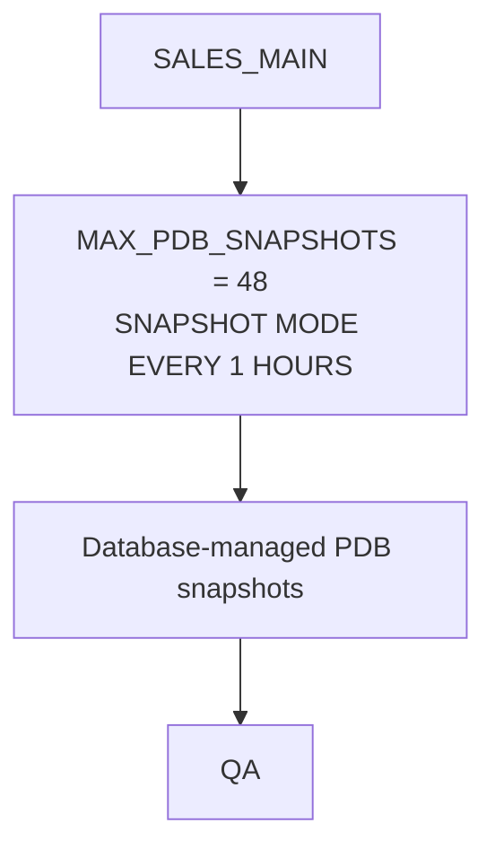

# Lab 02: PDB Snapshot Carousels

This lab demonstrates how to enable the database-managed PDB snapshot carousel
for `SALES_MAIN`, capture an optional precise post-refresh snapshot, and
provision a QA thin clone from the newest available snapshot.

The workflow uses the common `SALES_MAIN` source PDB created by setup:



`SALES_MAIN` is the masked development source created by the setup scripts.
The database manages the snapshot cadence after `SNAPSHOT MODE EVERY` is
enabled. `QA` is an optional read-write snapshot-copy clone created from the
newest snapshot once the carousel has produced one.

## About PDB Snapshot Carousels

A PDB snapshot carousel is a per-PDB, circular library of point-in-time
snapshots. The database can create snapshots manually or automatically. When
the configured snapshot limit is reached, it removes the oldest snapshot as it
creates the next one.

This lab configures `SALES_MAIN` to create an automatic snapshot every hour and
retains up to 48 snapshots:

```sql
ALTER PLUGGABLE DATABASE SET MAX_PDB_SNAPSHOTS = 48;
ALTER PLUGGABLE DATABASE SNAPSHOT MODE EVERY 1 HOURS;
```

The automatic snapshots have system-generated names. Manual snapshots remain
available while automatic mode is enabled, which is why this lab can capture
the named `SALES_POST_REFRESH_SNAP` immediately after a refresh.

On Exadata Exascale, Oracle Database uses native Exascale snapshots for the
underlying PDB files. The snapshot files reside in the same vault as the source
PDB and use redirect-on-write technology. Their initial physical storage use is
minimal; storage is consumed as data changes in `SALES_MAIN` or in a writable
clone. A carousel snapshot is read-only. To use one for development or test,
create a writable snapshot-copy clone, as this lab does for `QA`.

The clone operation needs archived redo from the snapshot time to make the PDB
files consistent. Retain the required archived redo and maintain normal RMAN
backups when keeping carousels beyond a short-lived lab.

Automatic and manual PDB snapshots require local undo mode. Confirm it before
running the lab:

```sql
SELECT property_value
FROM   database_properties
WHERE  property_name = 'LOCAL_UNDO_ENABLED';
```

For more detail, see:

- [Using a Carousel of Thinly Provisioned Pluggable Database Snapshots](https://docs.oracle.com/en/engineered-systems/exadata-database-machine/exscl/using-snapshot-carousel-pluggable-databases.html)
- [Administering a PDB Snapshot Carousel](https://docs.oracle.com/en/database/oracle/oracle-database/26/multi/administering-pdb-snapshots.html)

## Prerequisites

Complete [Prepare Your Environment](../docs/environment-setup.md) before
running setup or this lab.

- Oracle AI Database 26ai
- Exadata Exascale
- Exadata System Software 24.1 or later
- Oracle RAC with two or more instances
- Oracle Managed Files enabled
- CDB local undo mode enabled
- SQLcl or SQL*Plus
- SYSDBA or equivalent privileges
- `SALES_MAIN` exists and is open
- A separate target CDB is available for Lab 03. Lab 02 operates only in the
  source CDB.

Run setup first if required:

```sql
@../setup/00-create-sales-main.sql
@../setup/01-mask-data.sql
@../setup/02-verify-environment.sql
```

Lab 01 does not need to be left in place, but the common setup PDB must exist.

## Scripts

| File | Purpose |
|------|---------|
| `01-enable-snapshot-carousel.sql` | Sets `MAX_PDB_SNAPSHOTS = 48` and enables `SNAPSHOT MODE EVERY 1 HOURS` for `SALES_MAIN` |
| `02-verify-snapshot-carousel.sql` | Reports carousel mode, interval, maximum snapshots, and current snapshot metadata |
| `03-capture-post-refresh-snapshot.sql` | Captures a manually named, precise point after an in-place `SALES_MAIN` refresh |
| `04-create-qa-from-latest-snapshot.sql` | Creates `QA` from the newest available snapshot after one exists |
| `05-verify-qa.sql` | Verifies QA availability and service placement after Clusterware starts it |
| `06-cleanup.sql` | Drops `QA` and the named post-refresh snapshot, disables the automated carousel, and reports remaining interval snapshots |
| `90-run-lab.sh` | Optional shortcut that resets prior Lab 02 state and enables the carousel without pauses |
| `99-reset-lab.sh` | Removes the QA Clusterware resource and runs cleanup non-interactively |

## Walkthrough

Enable the automated snapshot carousel:

```sql
@01-enable-snapshot-carousel.sql
```

Verify carousel mode and snapshot metadata:

```sql
@02-verify-snapshot-carousel.sql
```

If the source must be captured immediately after an in-place refresh, rather
than at the next carousel interval, create a separate manual snapshot:

```sql
@03-capture-post-refresh-snapshot.sql
```

After a snapshot is available, first remove any prior QA clone from Clusterware
management. This stops its PDB service, closes the PDB through its Clusterware
resource, and removes both resources so the SQL can safely drop and recreate
`QA`. The command is idempotent: it reports and skips resources that are
already absent.

```bash
../common/manage-pdb-clusterware.sh stop-and-remove QA
```

Create the QA clone from the newest snapshot:

```sql
@04-create-qa-from-latest-snapshot.sql
```

Create and start its Clusterware PDB resource and service:

```bash
../common/manage-pdb-clusterware.sh ensure-and-start QA
```

Verify QA availability, service placement, and snapshot state:

```sql
@05-verify-qa.sql
```

Clean up the lab manually:

```sql
@06-cleanup.sql
```

Before cleanup, run `../common/manage-pdb-clusterware.sh stop-and-remove QA`.

For the supported non-interactive reset, which performs that Clusterware step
automatically, run:

```bash
./99-reset-lab.sh
```

Cleanup runs without interactive pauses. It drops the named precise
post-refresh snapshot, disables the automated carousel, and does not drop
database-managed interval snapshots that already exist.

## Shortcut to the Next Lab

Use this only when you want to enable and verify the Lab 02 carousel without
working through the individual steps. The runner resets prior Lab 02 objects,
then enables and verifies the carousel without pauses. It does not create `QA`,
because the first interval snapshot may not yet exist. Do not run the
walkthrough scripts again after using the shortcut unless you first reset the
lab.

```bash
./90-run-lab.sh
```

The runner uses SQLcl when available and SQL*Plus as the fallback. Set
`LAB_DB_CONNECT` to override the default `/ as sysdba` connection string.

## Notes

- The lab sets `MAX_PDB_SNAPSHOTS = 48` before enabling the carousel.
- The carousel uses `ALTER PLUGGABLE DATABASE SNAPSHOT MODE EVERY 1 HOURS`.
- The database creates and manages carousel snapshots after snapshot mode is
  enabled.
- An interval snapshot is scheduled independently of any refresh. It is not a
  post-refresh trigger. Use `03-capture-post-refresh-snapshot.sql` when an
  exact post-refresh point is required.
- Refresh `SALES_MAIN` in place. Do not drop and recreate it, because that
  discards the PDB and its carousel history.
- Disabling snapshot mode stops future automated snapshots. Existing
  database-managed snapshots remain visible in `DBA_PDB_SNAPSHOTS`.
- `QA` is created from the newest snapshot reported by `DBA_PDB_SNAPSHOTS`.
  That snapshot can be interval-created or the named precise post-refresh
  snapshot. `DBA_PDB_SNAPSHOTS` reports snapshot metadata but does not label a
  row by creation trigger, so keep the precise snapshot name distinct.
- `QA` is created as a thin clone with
  `CREATE PLUGGABLE DATABASE ... USING SNAPSHOT ... SNAPSHOT COPY`.
- Clusterware PDB resources and PDB services control clone availability and RAC placement.
- Oracle Managed Files is assumed, so no `FILE_NAME_CONVERT` clause is used.
- Project-level follow-up items are tracked in `../docs/todo.md`.
