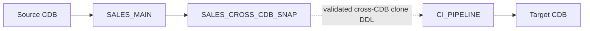

# Lab 03: Cross-CDB PDB Cloning

This lab validates the source and target CDBs independently, creates a
target-side private database link to the source CDB, creates a dedicated source
snapshot, and creates a read-write thin clone in the target CDB. It also
provides target verification and idempotent cleanup scripts.



## Prerequisites

Complete [Prepare Your Environment](../docs/environment-setup.md) before
configuring the two CDBs for this lab.

- The common prerequisites in [Prerequisites](../docs/prerequisites.md).
- A source CDB containing an open `SALES_MAIN` PDB.
- The Lab 03 verification data created by `setup/00-setup.sh`. If `SALES_MAIN`
  was created outside the setup wrapper, run
  `setup/01-create-lab-verification-data.sql` after it is open read-write.
- A separate, open target CDB that can host `CI_PIPELINE`.
- The source and target CDBs must use the same Exascale vault. They can be in
  separate VM clusters when the target database servers can reach the source
  CDB SCAN service. This lab uses native Exascale snapshot-copy thin cloning;
  cloning between Exascale vaults is not supported. See [Thin Cloning a
  Pluggable Database in a Different Container
  Database](https://docs.oracle.com/en/engineered-systems/exadata-database-machine/exscl/cloning-pdb-into-different-cdb.html).
- Oracle Net connectivity from every target-CDB database-server VM to the
  source CDB's SCAN service. For complete lab-series readiness, the source-CDB
  database-server VMs must also reach the target CDB's SCAN service.
- A source-CDB common user name and password for the database link. The Lab 03
  source-user script grants `CREATE SESSION`, `CREATE PLUGGABLE DATABASE`, and
  access to `V_$DATABASE`.
- The target-CDB user must have `CREATE DATABASE LINK` and `CREATE PLUGGABLE
  DATABASE`.
- SQLcl or SQL*Plus connections to both CDBs as users with the required
  administrative privileges.

Configure the lab without committing connection details:

```bash
cp config.sql.example config.sql
```

Set the source CDB name, target CDB name, target-side source database-link
name, source link account, its password, source Oracle Net connect identifier,
snapshot name, and target PDB name in `config.sql`. The local file is ignored
by Git, but it contains a password and must be protected accordingly. Use a
simple unquoted database-link name, such as `SOURCE_CDB_LINK`. Set
`LAB03_SOURCE_CONNECT_IDENTIFIER` to the source CDB's SCAN service, not an
individual RAC instance address. Lab 03 names each target PDB service by
appending `_SVC` to its PDB name.

Then provide separate client connections:

```bash
export LAB03_SOURCE_DB_CONNECT='sys/<source-password>@//<source-scan>:1521/<source-cdb-service> as sysdba'
export LAB03_TARGET_DB_CONNECT='sys/<target-password>@//<target-scan>:1521/<target-cdb-service> as sysdba'
export CDB_UNIQUE_NAME=<target-cdb-db-unique-name>
export RAC_SERVICE_PREFERRED=<target-instance-1>,<target-instance-2>
./00-run-lab.sh
```

For example:

```bash
export LAB03_SOURCE_DB_CONNECT='sys/Welcome1@//source-scan.example.com:1521/SOURCECDB as sysdba'
export LAB03_TARGET_DB_CONNECT='sys/Welcome1@//target-scan.example.com:1521/TARGETCDB as sysdba'
export CDB_UNIQUE_NAME=targetcdb_unique
export RAC_SERVICE_PREFERRED=tcdb1,tcdb2
./00-run-lab.sh
```

Both variables must connect to their respective CDB root services, not to
`SALES_MAIN` or another PDB service. Use credentials appropriate to your
environment rather than the illustrative password above. The runner obtains
`CDB_UNIQUE_NAME` and `RAC_SERVICE_PREFERRED` from the target CDB connection
before it manages target-CDB Clusterware resources and services.

Network connectivity alone is insufficient for this lab. Confirm that the
source and target CDBs use the same Exascale vault before running the
snapshot-copy clone steps. The CDBs may be in separate VM clusters.

The runner validates both CDBs, removes any prior Lab 03 clone state, creates
the source database-link user and target-side link, then creates and verifies
both the snapshot-based and direct thin clones. It leaves both target clones
running for inspection. Run `./99-reset-lab.sh` when final cleanup is required.
It verifies that the connections reach the configured CDBs, that `SALES_MAIN`
exists in the source CDB, and reports `OPEN_LINKS` and
`OPEN_LINKS_PER_INSTANCE` for every RAC instance. A value of `0` produces a
warning because it prevents database link use for the affected instance. It
also sets `GLOBAL_NAMES` to `FALSE` for each preflight session when required.
Set `GLOBAL_NAMES=FALSE` at the database level as described in
[Prerequisites](../docs/prerequisites.md#database-link-global-names). Both
preflights also report fast recovery area capacity and warn when it is full.
Maintain regular RMAN backups and archived-log management when retaining the
CDBs beyond the lab execution window.

## Scripts

| File | Purpose |
|------|---------|
| `config.sql.example` | Local configuration template for the two CDBs, source database link, snapshot, and target PDB |
| `00-run-lab.sh` | Resets prior Lab 03 objects, then creates and verifies both cross-CDB clone paths |
| `01-preflight-source.sql` | Validates the source CDB and `SALES_MAIN` |
| `02-preflight-target.sql` | Validates the target CDB before link creation |
| `03-create-source-link-user.sql` | Creates or updates the source-CDB common user and its database-link privileges |
| `04-create-source-database-link.sql` | Creates and validates the target-side private database link to the source CDB |
| `05-create-source-snapshot.sql` | Creates the dedicated Lab 03 source snapshot |
| `06-create-target-clone.sql` | Creates the target thin clone from the source snapshot through the database link |
| `07-verify-target-clone.sql` | Reports target clone RAC state, services, and storage |
| `08-create-direct-target-clone.sql` | Creates a direct thin clone from `SALES_MAIN` without using a PDB snapshot |
| `09-verify-direct-target-clone.sql` | Reports provenance and cloned Lab 03 verification data for the direct thin clone |
| `10-cleanup-direct-target.sql` | Idempotently drops the direct thin clone |
| `11-cleanup-snapshot-target.sql` | Idempotently drops the snapshot-based target clone and target-side private database link |
| `12-cleanup-source.sql` | Idempotently drops the Lab 03 source snapshot |
| `99-reset-target-lab.sh` | Removes target-CDB Clusterware resources and runs the target reset SQL non-interactively |
| `99-reset-target-lab.sql` | Removes both Lab 03 target PDBs and the target-side private database link |
| `99-reset-lab.sh` | Resets the target CDB, then removes the Lab 03 source snapshot |

## Walkthrough

Run source-side preparation from `CDB$ROOT` in the source CDB:

```sql
@01-preflight-source.sql
@03-create-source-link-user.sql
```

Run target-side preparation from `CDB$ROOT` in the target CDB:

```sql
@02-preflight-target.sql
@04-create-source-database-link.sql
```

The source-user script creates the common user named by
`LAB03_SOURCE_LINK_USER` when it does not exist. On re-runs, it resets that
user's password to `LAB03_SOURCE_LINK_PASSWORD`, then verifies the required
`CREATE SESSION` and `V_$DATABASE` privileges. Use a common-user name, such as
`C##LAB03_LINK`, because the database link connects to the source CDB root.

The script creates a private fixed-user database link using `CREATE DATABASE
LINK ... CONNECT TO ... IDENTIFIED BY ... USING ...`, then confirms that the
link reaches the configured source CDB. It stops if the configured link already
exists, preserving an existing object rather than replacing it. Review the
[Oracle SQL Language Reference](https://docs.oracle.com/en/database/oracle/oracle-database/26/sqlrf/CREATE-DATABASE-LINK.html)
when adapting authentication or connect-string behavior.

Create the source snapshot from `CDB$ROOT` in the source CDB:

```sql
@05-create-source-snapshot.sql
```

Create the target thin clone from `SALES_CROSS_CDB_SNAP`:

```sql
@06-create-target-clone.sql
```

The script creates the PDB in `MOUNTED` mode. Start the PDB and its service
with the shared Clusterware helper, using the target CDB's `DB_UNIQUE_NAME` and
its RAC instance names. `06-create-target-clone.sql` prints the exact exports
for the connected target CDB. For example:

```bash
export CDB_UNIQUE_NAME=<target-cdb-db-unique-name>
export RAC_SERVICE_PREFERRED=<target-instance-1>,<target-instance-2>
export PDB_CLUSTERWARE_PDB_CONFIG=./config.sql
../common/manage-pdb-clusterware.sh ensure-and-start <configured-target-pdb>
```

```sql
@07-verify-target-clone.sql
```

## Direct Thin-Clone Flow

Create a second target PDB directly from the current `SALES_MAIN` state, without
using `SALES_CROSS_CDB_SNAP`:

```sql
@08-create-direct-target-clone.sql
```

Start the configured `LAB03_DIRECT_TARGET_PDB` with the Clusterware helper,
then verify it:

```sql
@09-verify-direct-target-clone.sql
```

After both clone paths have been verified, clean up in dependency order. Run
the target-CDB scripts first, then remove the source snapshot:

```sql
-- Target CDB
@10-cleanup-direct-target.sql
@11-cleanup-snapshot-target.sql

-- Source CDB
@12-cleanup-source.sql
```

To reset the Lab 03 target CDB non-interactively, including Clusterware PDB
resources and services, use the target connection and target CDB Clusterware
environment:

```bash
export LAB03_TARGET_DB_CONNECT='sys/<target-password>@//<target-scan>:1521/<target-cdb-service> as sysdba'
./99-reset-target-lab.sh
```

The target reset removes `LAB03_DIRECT_TARGET_PDB`, `LAB03_TARGET_PDB`, and
the target-side database link. It does not remove the source snapshot; run
`@12-cleanup-source.sql` from the source CDB when that is also required.

To reset all Lab 03 objects in dependency order, set both connection variables
and run:

```bash
./99-reset-lab.sh
```

## Expected Results

- Source preflight reports the configured source CDB and `SALES_MAIN` as ready.
- Database-link creation reports that the configured link reaches the source
  CDB.
- Source snapshot creation records `SALES_CROSS_CDB_SNAP` in
  `DBA_PDB_SNAPSHOTS`.
- Target verification reports the target PDB across RAC instances, service
  placement, and logical datafile allocation after the Clusterware start. It
  also enters the target PDB and reports its `DBA_PDB_HISTORY` clone record,
  including the source PDB and clone tag, then queries the Lab-owned
  `LAB03_CLONE_SEED` rows copied from `SALES_MAIN`.
