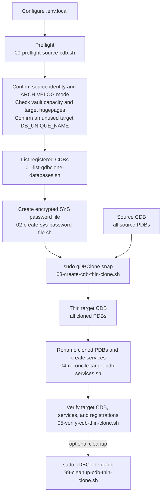

# Lab 04: Cloning Full CDBs with gDBClone

This lab uses `gDBClone` to create a thin clone of a complete CDB, including
all PDBs in the source CDB. Unlike the earlier PDB-focused labs, this workflow
creates a new CDB with its own `DB_UNIQUE_NAME`, instance configuration, and
Clusterware registration.



## Prerequisites

- The common [environment prerequisites](../docs/prerequisites.md), including
  gDBClone 5.0.2.2 or later.
- A source CDB running in `ARCHIVELOG` mode.
- The source CDB already stored in an Exascale vault.
- The thin-clone target CDB in the same Exascale vault as the source CDB.
- A target `DB_NAME` of up to eight alphanumeric characters and a separate,
  unique target `DB_UNIQUE_NAME` that is not already registered in the target
  environment.
- A target PDB-name prefix that does not occur at the beginning of any source
  PDB name and that, when prepended to every source PDB name, produces a name
  no longer than 30 characters. Also provide the target RAC instance names
  that should host the new PDB services.
- Capacity in the source Exascale vault and enough free hugepages on every
  target database server for the target CDB SGA.
- gDBClone installed as described in [My Oracle Support Doc ID
  KB145187](https://support.oracle.com/epmos/faces/DocumentDisplay?id=145187.1).
  Complete the sudo configuration required by the installation documentation
  for the account that will run this lab before proceeding. Oracle examples use
  `/opt/gDBClone/gDBClone.bin`; use the location installed in your environment.
  The Lab 04 scripts invoke gDBClone with `sudo -n` and stop if passwordless
  sudo authorization is unavailable.
- For a source CDB using Transparent Data Encryption, the TDE keystore must be
  configured for the target before creating the thin clone. This initial lab
  flow does not configure a keystore.
- The SYS password for the source CDB. Store it only in the encrypted gDBClone
  password file described below.

Download gDBClone and review its complete command reference in [My Oracle
Support Doc ID KB145187](https://support.oracle.com/epmos/faces/DocumentDisplay?id=145187.1).
The [Exadata Exascale User's Guide](https://docs.oracle.com/en/engineered-systems/exadata-database-machine/exscl/cloning-container-database.html)
provides the CDB thin-clone workflow and supported command options.

## Lab Steps

Run the following commands from `lab-04-cdb-thin-clones`.

The numbered shell scripts load `.env.local` automatically. Set `LAB_ENV_FILE`
to use a different environment-input file. Clone creation and cleanup require
typing `YES` at a confirmation prompt. Set `LAB04_CONFIRM=YES` only for an
intentional non-interactive run. The non-interactive runner also requires the
separate `LAB04_RUN_CONFIRM=YES` acknowledgement.

| File | Purpose |
|------|---------|
| `00-preflight-source-cdb.sh` | Verifies the source CDB identity and `ARCHIVELOG` mode, target PDB naming, vault capacity, target hugepages, source gDBClone registration, and an unused target name |
| `01-list-gdbclone-databases.sh` | Lists registered gDBClone databases, including their type, role, and parent relationship |
| `02-create-sys-password-file.sh` | Creates or replaces the encrypted SYS password file |
| `03-create-cdb-thin-clone.sh` | Revalidates the source CDB identity and gDBClone registrations, confirms the target, creates the clone, and records Lab 04 state |
| `04-reconcile-target-pdb-services.sh` | Renames cloned PDBs, which makes their default services unique, then creates and starts target PDB resources and `_SVC` services with Clusterware |
| `05-verify-cdb-thin-clone.sh` | Verifies the managed target registration and shows a compact PDB resource and service status table |
| `90-run-lab.sh` | Optional non-interactive shortcut that runs preflight, database listing, clone creation, PDB/service reconciliation, and verification |
| `99-cleanup-cdb-thin-clone.sh` | Confirms and removes only the target recorded by this Lab 04 run |

### 1. Configure and Preflight the Source CDB

Set the Lab 04 variables in the repository's ignored `.env.local` file. If you
do not already have `.env.local`, use the repository's existing `.env.example`
as its starting point. Set `LAB04_SOURCE_DB_UNIQUE_NAME`,
`LAB04_TARGET_DB_NAME`, `LAB04_TARGET_DB_UNIQUE_NAME`, gDBClone installation
path, and
`LAB04_SOURCE_DB_CONNECT`. The source connection must reach `CDB$ROOT` with
administrative privileges. Also configure `LAB04_TARGET_DB_CONNECT` for the
new target CDB so the verification step can validate the CDB and list its PDBs.
`LAB04_TARGET_DB_NAME` must begin with a letter and contain no more than eight
alphanumeric characters. It is passed to gDBClone as `--tdbname`.
`LAB04_TARGET_DB_UNIQUE_NAME` is passed separately as `--tdbuniquename` and
can include underscores.
Set `LAB04_TARGET_PDB_PREFIX` to a target-specific prefix, for example
`C8DB9_`. Optionally set `LAB04_RAC_SERVICE_PREFERRED` to the target CDB RAC
instances, for example `C8DB91,C8DB92`; when it is empty, Lab 04 derives those
instances from `srvctl config database -db <target-DB_UNIQUE_NAME>`. The lab renames every cloned user PDB
to `<prefix><source-PDB-name>`, and creates a Clusterware-managed service named
`<target-PDB-name>_SVC` for each one. This is required when source and target
CDBs register with the same listener: a PDB's default service has the same name
as the PDB and cannot be managed or renamed independently. Choose a prefix
that does not begin any source PDB name and that leaves each resulting target
PDB name at 30 characters or fewer.
When the preferred-instance value is configured, the reconciliation step
validates it against Clusterware before it renames a PDB or creates a service.
`LAB04_RAC_MODE=2` creates an Oracle RAC target CDB. Confirm the appropriate
gDBClone RAC mode for your target topology before changing this setting.
Optionally set `LAB04_SGA_TARGET_MB` and `LAB04_SGA_MAX_SIZE_MB` to pass
`-sga_target` and `-sga_max_size` to gDBClone. Both values are in MB. When a
value is empty, gDBClone inherits the corresponding source-CDB setting. Set
`LAB04_TARGET_DB_NODES` to every VM-cluster database server VM that can host
the target CDB. Do not specify underlying KVM hosts. The preflight reads
hugepages locally when the current server is in that list and uses passwordless
SSH only for the other database server VMs.
Use operating-system authentication or an external password store for these
administrative connections. Do not place a SYS password in `.env.local`.

Run the preflight. It verifies that the source connection matches the configured
`DB_UNIQUE_NAME`, is in `ARCHIVELOG` mode, and is registered with gDBClone. It
also checks each finite Exascale vault media allocation and free hugepages on
every target database server. It stops when vault free capacity is 10% or less,
warns at 20% or less, and stops if free hugepages are below either effective
SGA setting. Adjust the vault thresholds through `LAB04_VAULT_WARN_FREE_PCT`
and `LAB04_VAULT_ERROR_FREE_PCT` when the environment uses a different
operational policy. When the vault has no finite allocation, the preflight
reports that storage-pool capacity requires administrator review. The preflight
also stops if the target name is already registered.

```bash
./00-preflight-source-cdb.sh
```

### 2. List Registered CDBs

List the databases registered with gDBClone before creating anything. Use the
table to identify the CDB used for Labs 01 and 02, confirm its role, and verify
that the target name is not already present:

```bash
./01-list-gdbclone-databases.sh
```

The Lab 04 default source is the CDB that hosts `SALES_MAIN` for Labs 01 and
02. You can intentionally select another source CDB, provided it meets this
lab's prerequisites.

### 3. Create an Encrypted SYS Password File

Do not place the SYS password in `.env.local` or on a command line. Create an
encrypted password file with gDBClone instead:

```bash
./02-create-sys-password-file.sh
```

The command prompts for the source CDB SYS password. gDBClone uses this file
with the `-syspwf` option. By default, Lab 04 stores it as
`lab-04-cdb-thin-clones/SYSpasswd_file`. The file is Git-ignored and the script
protects it with mode `600`; set `LAB04_SYS_PASSWORD_FILE` only to use another
protected absolute path.

The script invokes `gDBClone.bin syspwf -syspwf <password-file>`. gDBClone
prompts for the SYS password and its confirmation; neither value is placed in
the command line or in `.env.local`.

### 4. Create the CDB Thin Clone

Re-run `listdbs` after setting the source and target variables. Confirm that
`LAB04_SOURCE_DB_UNIQUE_NAME` identifies the intended source CDB and that
`LAB04_TARGET_DB_UNIQUE_NAME` is unused before running `snap`. The clone
command passes both the target `DB_NAME` and target `DB_UNIQUE_NAME`.

```bash
./03-create-cdb-thin-clone.sh
```

`snap` creates a thin, redirect-on-write clone in the same Exascale vault. It
clones the source CDB and all its PDBs as one CDB-level operation.

### 5. Reconcile Cloned PDB Names and Services

Do this immediately after the CDB clone and before using its PDBs. When the
source and target CDBs use a common listener, each cloned PDB initially has the
same default service name as its source PDB. Oracle requires the PDB to be
renamed to resolve this collision. The script closes each cloned PDB across the
RAC cluster, opens it restricted on one instance, changes its global name, and
then lets Clusterware start the renamed PDB and its new `_SVC` service.

```bash
./04-reconcile-target-pdb-services.sh
```

The script records the renamed PDBs in the local Lab 04 state file. It uses
`common/manage-pdb-clusterware.sh`, the same shared helper used by the earlier
labs, to create, start, and verify the target PDB resources and services.

### 6. Verify the Clone

Verify the clone and its relationship to the source:

```bash
./05-verify-cdb-thin-clone.sh
```

## Cleanup

Use gDBClone to remove the target CDB. The cleanup script refuses to operate
unless the target matches the local Lab 04 state recorded after a successful
clone creation. If reconciliation was interrupted before its PDB list was
recorded, cleanup verifies the target CDB and discovers PDBs with the configured
target prefix before removing their Clusterware resources and services.

```bash
./99-cleanup-cdb-thin-clone.sh
```

Run `listdbs` again to verify that the target CDB has been removed.

## Non-Interactive Shortcut

After completing the encrypted password-file step, run preflight, database
listing, clone creation, PDB and service reconciliation, and verification
without interactive prompts:

```bash
export LAB04_RUN_CONFIRM=YES
./90-run-lab.sh
```

This runner still stops for failed preflight checks, an existing target name,
or any gDBClone error. It does not create the encrypted SYS password file and
does not perform cleanup.

## Expected Results

- `listdbs` shows the source CDB, the new thin CDB clone, and its parent CDB.
- The target verification confirms its distinct `DB_UNIQUE_NAME` and lists its
  PDBs.
- Each cloned user PDB has the configured target prefix, a distinct default
  service, and a running Clusterware-managed `<PDB>_SVC` service.
- `deldb` removes the target CDB and its gDBClone registration.
